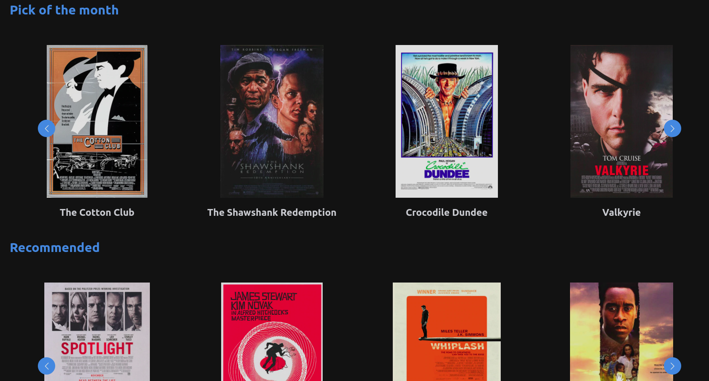
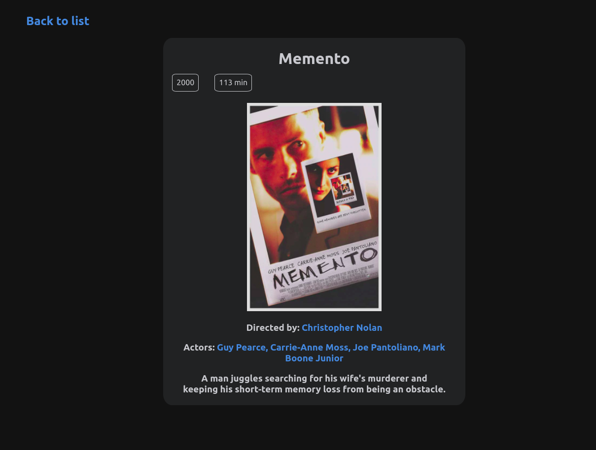
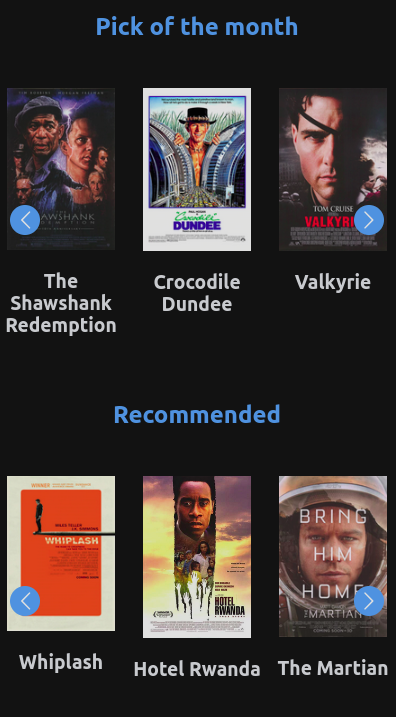

# Mobile Responsive Web App

&nbsp;

## Created using React.js and [react-multi-carousel](https://www.npmjs.com/package/react-multi-carousel) for carousel display

&nbsp;

&nbsp;

# Installation

1. Clone the GitHub repo to your PC
2. Open project folder in terminal and run `npm install`
3. Launch the server using `npm start`
4. It should automatically open `http://localhost:3000/` in your browser

&nbsp;

# Screenshots

&nbsp;

## WEB

&nbsp;

### Homepage

&nbsp;

&nbsp;

### Detail Page

&nbsp;

&nbsp;

&nbsp;

## MOBILE

&nbsp;

### Homepage

&nbsp;

&nbsp;

### Detail page

&nbsp;

